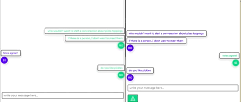

# GraphQL Chat

A conversation based chat application. 

This app include an api server that allows a client to perform CRUD operations on `user`, `conversation` and `message` resources as well as a front-end that provides a UI to interact with API.

The api is a GraphQL server and includes a websocket implementation in order to establish full-duplex communcation between the api and connected clients.

The front-end is built with React and relies on Apollo-client for state management.

## Getting Started

## Run the server and seed the mongodb database

1. Navigate into the `/api` directory

```sh
cd api/
```

2. first build the image, replacing `<image-name>` with an image tag of your choosing

```sh
docker build -t <image-name> .
```

3. ensure you have a `.env` and login credentials for mongoDb ensuring that you appropriately copy the environment variables from the `./env.example` file with your appropriate credentials.

4. run a docker container to start the graphql server and expose port 8090 and specify your `.env` file

```sh
docker run --env-file .env -p 8090:8090 <image-name>
```

5. Seed the database by opening a shell into the running container and running the seed script replacing `<container-id>` with the running container's id.

```sh
docker exec -it <container-id> /bin/sh

# once in container
yarn seed
```

This will seed your database with some users which you can then use to login, as well as some conversations with some seeded messages.

## Run the UI

1. navigate into the `/frontend` directory

```sh
cd ./frontend
```

2. first build the image, replacing `<image-name>` with an image tag of your choosing

```sh
docker build -t <image-name> .
```

3. run a docker container to server the React application and expose port 3000

```sh
docker run -p 3000:3000 <image-name>
```

4. navigate to `http://localhost:3000/messages` 
  a. this will prompt you to login. Use seeded api seeded data to login with a user that currently exists
    - username: `rosemaryh`
    - password: `password`
  b. this will virtually redirect you to messages where you can start creating new messages 

## Socket communication between two users

